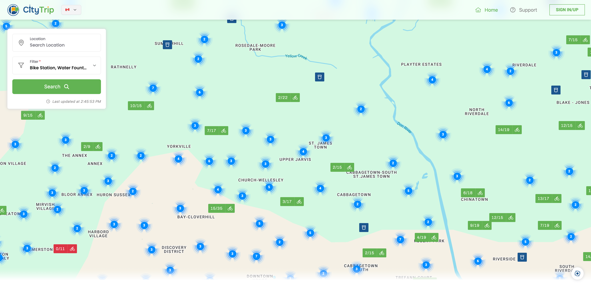
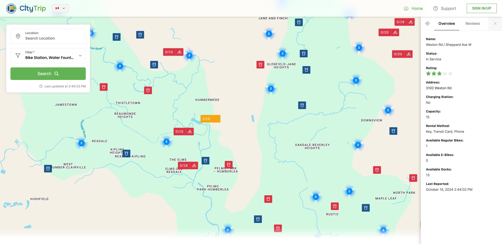
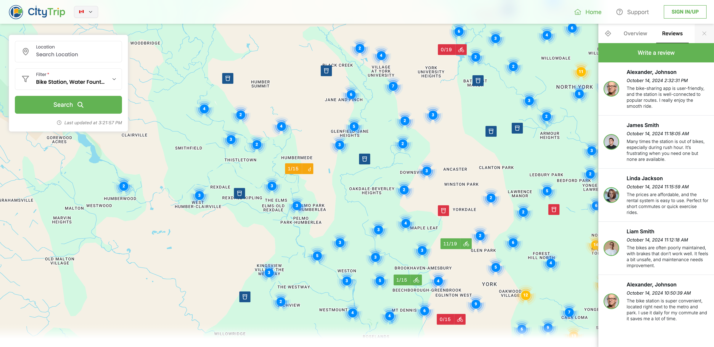
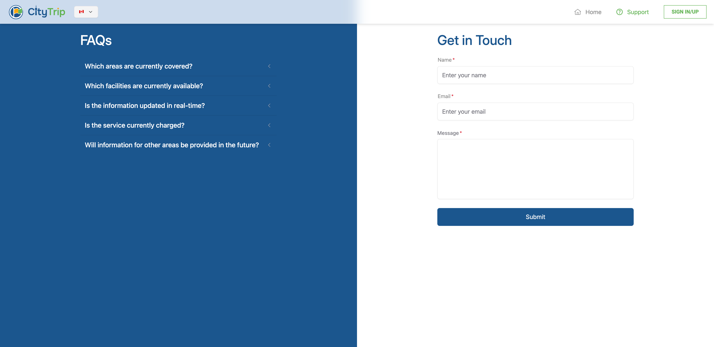
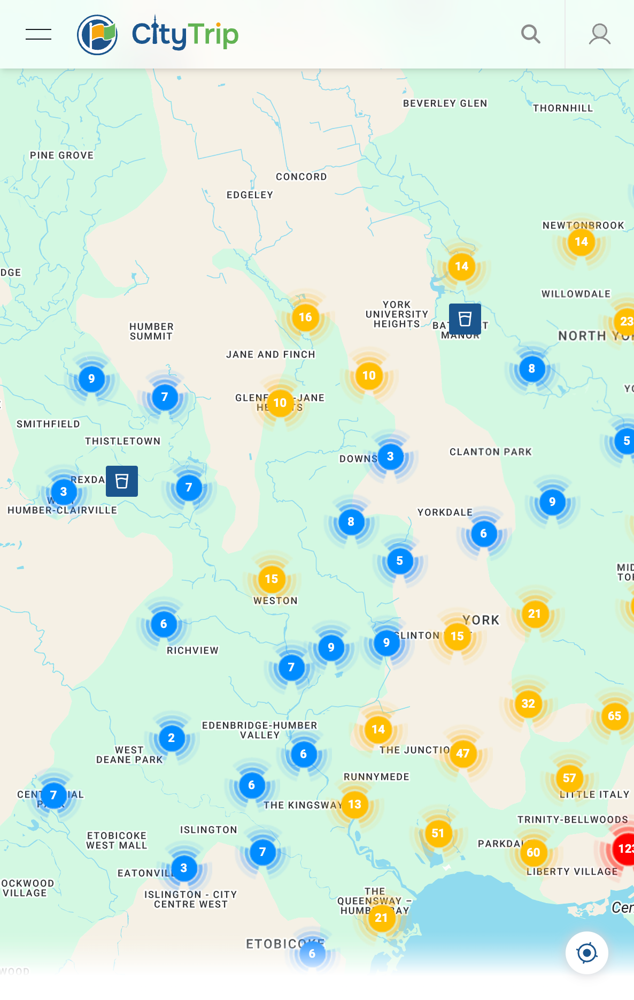
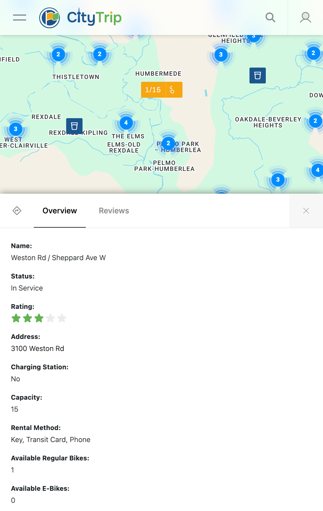
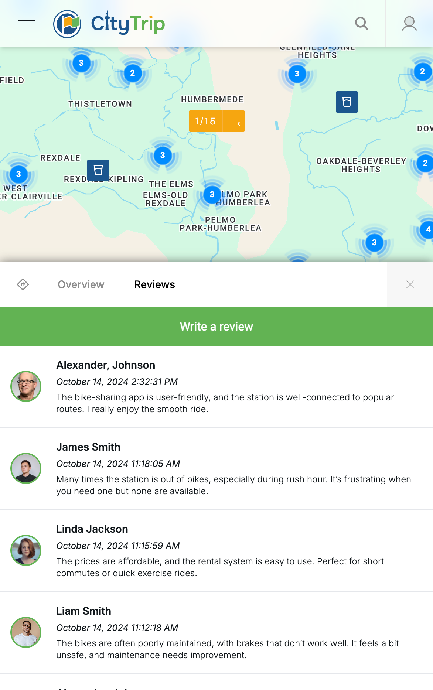
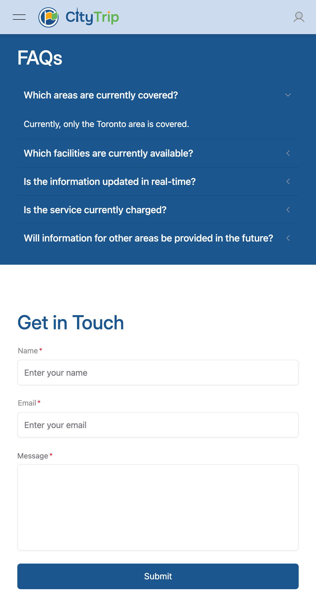

  

# CityTrip

## Introduction
CityTrip helps you navigate your city effortlessly, whether you're biking or exploring on foot. We make city exploration easier and more enjoyable by helping you find the nearest bike stations and water fountains.

#### Bike Rental/Return
Find bike rental stations quickly, check bike availability in real-time, and locate bike return
stations. CityTrip makes renting and returning bikes simple with up-to-date info on
availability and docking spaces.

#### Water Fountain Mapping
Stay hydrated with CityTrip! Find water fountains on a map, see details like location and
type.

#### General Features
1. Interactive Map
  - User-friendly map interface with zoom and pan capabilities.
  - Directions to bike stations and fountains from user’s current location.
2. Search and Filters
  - Search functionality for specific bike stations or fountains by location.
  - Filters for bike stations based on bike type (e.g., regular, electric).
3. Accessibility
  - Multilingual support to cater to diverse user groups.
4. Rating
  - Allow signed-in users to rate bike stations and water fountains.
  - Ratings are visible in the station/fountain overview.
5. Feedback and Support
  - Feedback mechanism for users to suggest improvements or report issues.

## Screenshots

### Desktop

**Home**

**Overview**

**Reviews**

**Support**

----

### Mobile

**Overview - Mobile**

**Reviews - Mobile**

**Support - Mobile**

## Setup
- **Frontend Repository**: [CityTrip Frontend Setup](https://github.com/joeyin/CityTrip/tree/main/frontend#setup)
- **Backend Repository**: [CityTrip Backend Setup](https://github.com/joeyin/CityTrip/tree/main/backend#setup)

## References

- **Wireframe**: [Figma Wireframe](https://www.figma.com/proto/GJ2NAVm6xiuGHe4bkeNrNl/CityTrip?node-id=4-2&node-type=frame&t=DQhUnosAlMdUAMAf-0&scaling=min-zoom&content-scaling=fixed&page-id=0%3A1)

## Contributors

- **Designer**: [Joeyin](https://www.linkedin.com/in/chiweiyin/)
- **Developer**: [Joeyin](https://www.linkedin.com/in/chiweiyin/)
